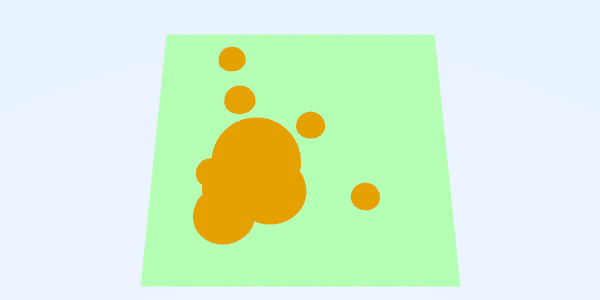
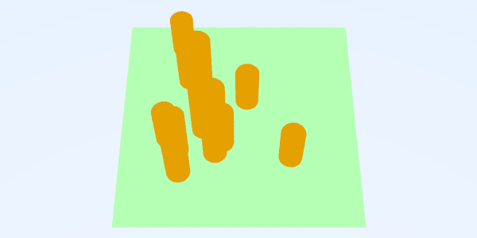
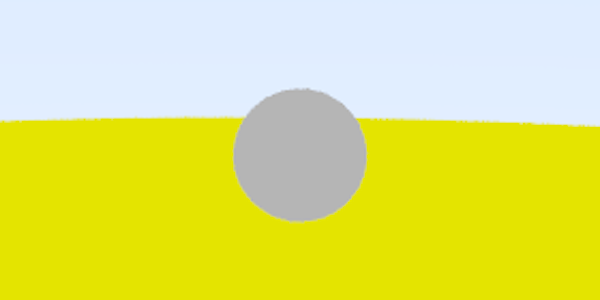
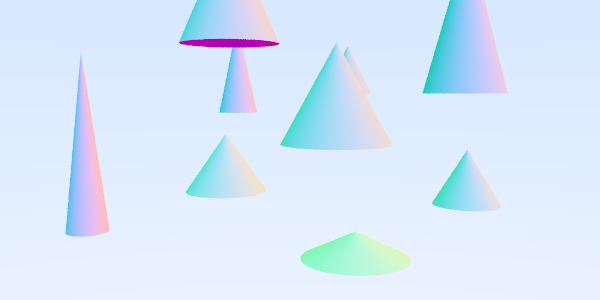

# RayTracingGiVD 2020-21

## Equip:

**F01**: Albert Mir, Carla Morral, Martí Pedemonte, Arnau Quindós

## Features
- Fase 1
    - [X] Background amb degradat: Arnau

    - Creació de nous objectes i interseccions (VIRTUALWORLD) 
        - [X] 4.1.a. Mapping de mons virtuals: Albert
        - [X] 4.1.b. Hit Triangle: Carla
        - [X] 4.1.c. Hit Boundary Object: Arnau
        - [X] 4.1.d. Hit Cilindre: Martí
    - Creació de REAL DATA
        - [X] 4.2.a. Transformacions Translació i Escalat amb gizmos esferes: Arnau, Albert, Carla
        - [X] 4.2.b. Pla de terra: Martí
        - [X] 4.2.c. Gizmo de Triangle: Arnau
        - [X] 4.2.d. Gizmo de Cilindre: Martí?
        - [X] Noves dades: Arnau (fase 3)
       

- Fase 2
    - [X] Antialiasing: Albert, Arnau, Carla
    - [X] Gamma Correction: Albert, Arnau, Carla
    - [X] Blin-Phong: Arnau
    - [X] Ombres amb objectes opacs: Martí
    - [X] Reflexions: Carla
    - [X] Transparències: Albert (fix by Martí)
    - [X] Visualització amb dades reals: Arnau
    
    
- Fase 3
    - [X] Texture mapping en el pla: Albert, Arnau
    - [X] MaterialTextura: Albert
    - [X] Nova escena de dades: Arnau
   
- Parts opcionals
    - [X] Nous objectes paramètrics (Con): Martí
    - [ ] Penombres 
    - [ ] Diferents tipus de llums 
    - [X] Multiple-scattering: Martí
    - [ ] Escena CSG 
    - [X] Ambient occlusion: Carla
    - [ ] Defocus blur
    - [ ] Més d'una propietat en les dades reals ?
    - [X] Animacions amb dades temporals: Albert (tot i que no és amb dades temporals, sino en virtualWorld)
         - [X] Escena animació planetes (rotació i translació): Albert i Arnau 
    - [ ] Ombres atenuades segons objectes transparents
    - [X] Colors d'ombra segons els colors dels objectes transparents: Carla
    - [ ] Mapeig de les dades reals en una esfera
    - [ ] Ús de diferents paletes 
    - [X] Acabament adaptatiu recursivitat: Martí
    
## Explicació de la pràctica    
_Comentaris de aspectes particulars de la vostra pràctica. Es pot seguir el guió de l'enunciat o fer una explicació més general amb alguns screenshots que avalin les vostres explicacions_

### Fase 0
    
La fase 0 és una fase premiliminar en la qual l'objectiu era familiaritzar-se amb el projecte i obtenir les primeres visualitzacions.

La primera que vam obtenir va ser el background de l'escena, un degradat des del blau RGB(0.5, 0.7, 1) fins el blanc RGB(1,1,1).

Les esferes ja estaven implementades al projecte i nosaltres vam implementar el mètode `hit` per detectar la col·lisió dels rajos del RayTracing amb les esferes de l'escena. Un cop implementat això i utilitzant la normal del raig sobre cada punt de l'objecte com a color, aquest és el resultat obtingut amb una sola esfera.

Afegint més esferes a l'escena i canviant certs paràmetres de la càmera com el `vfov` i el `lookFrom`, hem obtingut la següent imatge.

Els fitxers `configVis.txt` i `spheres.txt` utilitzats per obtenir la visualització anterior es troben al directori readmeFiles/fase0.

### Fase 1

L'objectiu de la fase 1 era construïr una escena virtual, utilitzant tant dades virtuals (esferes, triangles, cilindres...) com dades reals representades en una escena virtual. Tot i que les visualitzacions d'aquesta fase continuïn en un estat molt preliminar, tot el codi que hem fet a aquesta fase ens ha serveix per poder fer visualitzacions més interessants a la fase 2 i 3.

Les tasques d'aquesta fase es divideixen en dues parts molt diferenciades però complementàries:
- les que inclouen els nous tipus d'objectes i les seves interseccions a partir d'una escena
`VIRTUALWORLD`
- les que situen creen l'escena corresponent a les dades geolocalitzades a partir d'un fitxer de
dades `REALDATA`

#### VIRTUALWORLD

_Nota: En aquesta fase, tot i que els objectes tenen atribut `diffuse` que es pot utilitzar com a color de l'objecte, mostrarem les visualitzacions utilitzant com a color la normal del raig que intersecta cada punt de l'objecte, ja que ajuda a diferenciar millor les formes 3D._

El primer que se'ns demanava era la implementació dels objectes tipus `Triangle`, amb el seu hit corresponent. Els triangles consisteixen en 3 punts (`vec3`) que corresponen als tres vèrtexs del triangle. A continuació podem veure 3 triangles situats a una escena virtual.

    
Pel cas dels `boundaryObject`, que són malles poligonals, els hem implentat utilitzant directament l'objecte `Triangle`que acabem de crear, i al seu mètode hit no hem fet res més que utilitzar el hit del conjunt de triangles que formen la malla triangular. Un exemple és `cube.obj`, un objecte que se'ns proporcionava i que utilitza 12 triangles per formar les 6 cares del cub. Hem obtingut la visualització següent.

    
Finalment, també hem implementat els objectes tipus `Cylinder`, utilitzant els atributs: centre de la base, radi i alçada. Les generatrius dels cilindres sempre seran verticals, és a dir, paral·leles al vector (0,1,0), de manera que aquests 3 atributs són suficients pels cilindres que tindrem al nostre projecte. Hem afegit 3 cilindres diferents a l'escena i hem obtingut la visualització següent.

#### REALDATA

En aquesta fase hem implementat el mapeig de dades del món real a dades del món virtual. L'objectiu final és poder representar dades geolocalitzades en una visualització per representar dades. 

Per exemple, podríem representar la població de cada capital europea de la següent forma. Un conjunt esferes sobre un pla (que té de textura el mapa d'Europa), on el radi de cada esfera es proporcional a la població i cada esfera està situada al punt del mapa que representa la seva geolocalització real. De moment, a aquesta fase només hem implementat la part del mapeig.

Hem implementat el mapeig de dades reals a virtuals i els mètodes `aplicaTG` de cada tipus d'objecte utilitzant la classe `TG` que havíem fet a la pràctica 0, tal com se'ns recomanava al guió. Per exemple, per mapejar un punt geolocalitzat del món real al món virtual utilitzem una sèrie de transformacions geomètriques aplicades seqüencialment que resulten en una nova transformaicó geomètrica que és que necessitem, com podem veure a continuació.

    glm::mat4 restamR = glm::translate(glm::mat4(1.0f), -Rmin);
    glm::mat4 divisioRDiff = glm::scale(glm::mat4(1.0f), vDiv);
    glm::mat4 vDiff = glm::scale(glm::mat4(1.0f), Vmax - Vmin);
    glm::mat4 sumaVmin = glm::translate(glm::mat4(1.0f), Vmin);
    auto tg = make_shared<TG>(sumaVmin*vDiff*divisioRDiff*restamR);
    
També se'ns demanava implementar la classe `FittedPlane`, que ens serveix per situar a sobre objectes a les escenes, com si fos el terra. A continuació en mostrem un exemple.
    

Hem creat un fitxer de dades `data10.txt` de món real amb 10 files de dades amb valors arbitraris, tal com es demanava al guió. Podem visualitzar aquestes dades amb diferents objectes, el que s'anomena _gizmo_. A continuació mostrem les visualitzacions utilitzant els gizmos d'esferes i cilindres.

gizmo `Sphere`         |  gizmos `Cylinder`
:-------------------------:|:-------------------------:
  |  

Els fitxers `data10.txt`,`configVisData10.txt` i `configMappingData10.txt` utilitzats per obtenir les visualitzacions anteriors es troben a readmeFiles/fase1.

El que ens interessa d'aquesta fase és que el mapeig (tant de posició com de valor) es realitzi correctament, ja que quan introduïm la resta de funcionalitats a les fases 2 i 3 serà imprescindible aquesta part. Amb les visualitzacions anteriors podem veure que (en principi) això es realitza correctament, però ho tornarem a veure més endavant en les properes fases.

### Fase 2

L'objectiu de la fase 2 de la pràctica era crear els materials de forma completa i desenvolupar el càlcul de la il·luminació de l'escena segons el model de Blinn-Phong. 

Durant tota la part de món virtual de la fase 2 utilitzarem la mateixa escena amb mínims canvis (afegint certs objectes) per tal de veure els canvis que suposa cada nova implementació al nostre codi i poder evaluar cada part per separat.

Com les visualitzacions a partir d'aquest punt són més el·laborades, per  millorar la qualitat de les imatges resultants, hem implementat *supersampling*, i.e. tirar diversos rajos per píxel amb una certa petita variació aleatòria per reduir l'aliasing. A continuació podem veure la millora que suposa aquest petit canvi. 

`numSamples=1`        |  `numSamples=10`  
:-------------------------:|:-------------------------:
  |  
  |  

El primer pas per desenvolupar escenes amb il·luminació és la creació d'un objecte `Light`, que de moment serà de tipus puntual, és a dir, un punt des d'on surten rajos de llum en totes direccions. Aquest objecte tindrà un atribut posició, tres components: ambient, difusa i especular i un polinomi d'atenuació del qual guardarem els 3 coeficients a, b, c. Aquest polinomi representa com s'atenua la llum a mesura que augmenta la distància entre el punt de llum i l'objecte que il·lumina. També tindrem llum ambient global, que representa els rajos de llum que reboten múltiples cops i acaben il·luminant tots els punts de l'escena de forma uniforme.

Per a les properes visualitzacions, utilitzarem una llum puntual a la posició (2, 8, 10) amb Ia= (0.3, 0.3, 0.3), una Id = (0.7, 0.7, 0.7), una Is = (1.0, 1.0, 1.0) i un coeficient d'atenuació de 0.5 + 0.01d^2. També tindrem una llum ambient global (0.1, 0.1, 0.1).

Hem implementat Blinn-Phong a la classe `Scene` com s'indicava a les transparències i a continuació mostrarem els resultats obtinguts pas a pas. L'esfera que utilitzarem és de material `Lambertian` amb Ka =(0.2,0.2, 0.2), Kd=(0.5, 0.5, 0.5), K_s = (1.0, 1.0, 1.0) i una shineness de 10.0.

Calcul·lant només la component ambient:

Només la component difusa:

Només la component especular:

Amb la suma de les tres components anteriors:

Afegint l'atenuació de la llum:

Finalment, afegim la llum ambient global:

Afegint el raig d'ombra de Blinn-Phong:

Per aquesta part hem tingut en compte l'anomenat _shadow acné_, i en comptes de fer servir un `t_min=0` a la intersecció del raig d'ombra hem considerat un epsilon de 0.001.

Arribats a aquest punt, podem aprofitar la varietat d'objectes que tenim implementada per aplicar Blinn-Phong a una escena més complexa, com la següent.

_Afegim a readmeFiles/fase2 el fitxer `Scene_Fase2A_Complex.txt` que conté les 10 figures que formen l'escena._

Seguidament hem implementat la recursivitat al nostre algorisme de raytracing. Podem veure les diferències subtils entre una imatge amb profunditat màxima 1 i una amb profunditat màxima 10 a la taula següent:

`MAXDEPTH=1`        |  `MAXDEPTH=10`  
:-------------------------:|:-------------------------:
  |  

Veiem que la de més profunditat és lleugerament més lluminosa. També hem implementat que els rajos secundaris que no intercepten amb l'escena no tinguin la llum del background, sino de la intensitat global. Com podem veure a la següent imatge, amb `MAXDEPTH=4`, és notablement més fosca:

Veiem ara com queden els materials metàlics, és a dir, els que reflexen els rajos de llum, amb `MAXDEPTH=4`:

A continuació hem implementat els materials transparents. A la taula següent podem veure una imatge amb diferents profunditats màximes de materials transparents. Tal com ens proposa el guió, l'índex de refracció de l'objecte transparent mostrat és 1.5 superior a l'aire de l'escena.

`MAXDEPTH=1`        |  `MAXDEPTH=4`  
:-------------------------:|:-------------------------:
  |  

Veiem que sense gaire profunditat els rajos secundaris no poden adquirir el color dels elements refractats.

#### Visualization mapping

Per la part de dades reals d’aquesta fase, estava tot pràcticament implementat a la fase 1, amb la petita dificultat que havíem d’invertir l’eix de les Z, ja que si mirem l’origen de les z’s en el pla XZ, a les dades reals és abaix a la dreta mentre que l’origen al món real és a dalt a la dreta, per poder fer les correspondències amb el mapa de referència. Per fer això, vam canviar el mètode que mapeja els punts de món real a món virtual per tal que ho fes correctament.

També cal comentar que no mapegem el valor del rang inicial (VminReal, VmaxReal) al rang (0, VmaxVirtual), ja que llavors el punt mínim del món real tindria un valor al món virtual de 0 (i per tant un radi de 0 en el cas del gizmo esfera). Per aquest motiu, vam decidir realitzar el (VminReal, VmaxReal) al rang (0.01·VmaxVirtual, VmaxVirtual), i d'aquesta manera, els gizmos amb valor mínim es veuen molt petits però es veuen, cosa que ens interessa per la representació de dades.

A continuació podem veure el resultat del mapeig de les esferes amb l’inversió de l’eix z utilitzant el fitxer `DataBCN.txt` i els paràmetres indicats al guió de la pràctica, i `MAXDEPTH=0` (i.e. sense recursivitat).

_A la fase 3 implementarem les texures i veurem que el mapeig es realitza correctament sobre mapes._

### Fase 3: Textures
Per implementar les textures, hem creat una nova classe subclasse de `Material`, `MaterialTextura`. A més, un nou mètode de la classe `Material`, el `getDiffuse`. Aquest mètode, tal i com s'indicava a l'enunciat, és un mètode virtual i per tant s'implementa per a tot els materials, i es crida cada cop que es vol obtenir la component `diffuse` d'un `Material`. 

Tots els materials excepte el `MaterialTextura` retornaran simplement la component difosa, mentres que a `MaterialTextura`, donades les coordenades u,v normalitzades (entre 0 i 1), retorna el color corresponent un cop aplicat el mapeig de u,v a les coordenades de la imatge de la textura del material. Un cop tenim això, només cal que, a blinn-phong, en comptes de retornar la component difosa del material com es feia fins ara, es cridi a aquest nou mètode `getDiffuse`, amb les components u,v normalitzades. Aquestes components u,v s'afageixen ara com a paràmetre, i es calculen en el mètode hit de cada objecte del qual es vulgui implementar Textures, posant un if en cas que el material de l'objecte sigui `MaterialTextura` (altrament, es deixen en 0,0, o qualsevol valor, ja que `getDiffuse` simplement retornarà la component difosa). 
Inicialment, només implementem textures per a objectes del tipus `fittedPlane`:

    
### Opcionals

#### Implementació de nous objectes paramètrics: Con

A part de tots els objectes que se'ns demanaven, també hem implementat els objectes tipus `Cone`, utilitzant els atributs: centre de la base, radi de la base i alçada. Els cons sempre estaran orientats verticalment, és a dir, amb l'alçada paral·lela al vector (0,1,0), de manera que aquests 3 atributs són suficients. Hem afegit uns quants cilindres diferents a l'escena, amb el color corresponent a la normal de cada cara, i hem obtingut la visualització següent.

#### Implementació de Multiple-scattering

Hem implementat la dispersió de múltiples rajos per a materials lambertians, ja que es produeixen materials molt menys rugosos i més realistes (malgrat que també és més costos computacionalment a l'hora de generar les imatges, ja que és O(n^d), on n és el nombre de rajos dispersats i d és la profunditat màxima). Podem veure la diferència del multiple-scattering a les imatges següents:

`MAXDEPTH=4, numRays=1`         |  `MAXDEPTH=4, numRays=20`
:----------------------------------:|:----------------------------------:
  |  

_Afegim a readmeFiles/fase3 els fitxers `configVis_multiple.txt` i `spheres_multiple.txt` per a recrear l'escena anterior._

#### Acabament adaptatiu de la recursivitat

Hem implementat un acabament adaptatiu de la recursivitat dels raigs quan contribueixen poc al color del píxel. Hem afegit un argument al mètode ComputeColor de `Scene.cpp` que porta el color acumulat, i es para la recursivitat quan el mòdul del color acumulat és més petit que un cert valor `ACCCOLOR` definit a `Scene.h`. Així podem millorar eficiència de l'algorisme en detriment de menys lluminositat en certes parts de la iamtge (ja que estem despreciant contribucions petites). A continuació es poden veure tres imatges corresponents a la fase 2, amb `MAXDEPTH=5` i el nombre de raigs del lambertià a `NUMRAYS=5`, en tots els casos, però canviant el valor de `ACCCOLOR`. També es mostra el nombre de crides al mètode ComputeColor, que disminueix quan augmenta el paràmetre `ACCCOLOR`, ja que acaba l'algorisme abans.

`ACCCOLOR=0`, crides = 9509461 |  `ACCCOLOR=0.5`, crides = 8257626 | `ACCCOLOR=0.9`, crides = 7296206 
:----------------------------------:|:----------------------------------:|:----------------------------------:
  |    |  

Podem veure que a mesura que s'augmenta el paràmetre la imatge es torna una mica més fosca.

#### Ambient Occlusion

A continuació podem veure el resultat de la implementació del Ambient Occlusion en una escena amb bastants objectes. Com es pot veure, l'Ambient Occlusion provoca que aquelles parts entre els objectes i les ombres s'enfosqueixin una mica. Es pot apreciar en les imatges. Per tal de fer les visualitzacions tots els objectes s'han fet de material lambertià i en el cas del Ambient Occlusion s'ha suposat escena outdoor i s'han tirat 30 raigs (`NUMRAYSAO=30`). Quan a la produnditat, no hem tirat raigs reflectits en cap cas i per tant `MAXDEPTH=0`.

Resultat sense Ambient Occlusion |  Resultat amb Ambient Occlusion
:----------------------------------:|:----------------------------------:
  |  

#### Ombres de colors
Seguidament podem veure una visialització amb esferes transparents que tenen ombres de diferents colors. Cal comentar que no hem aconseguit que les ombres prenguin el color de les esferes, però creiem que així queda molt maco visualment. 

Resultat
:----------------------------------:

#### Animacions
Hem decidit implementar animacions però no per dades del món real, si no per a objectes del món virtual.
S'ha aprofitat un tipus de data no implementat anomenat `TEMPORALVW`, per tal que es realitzés l'animació si el tipus de mon era `TemporalVW`. D'aquesta manera s'inicialitzarà un render del tipus `RayTracingTemps`, que a cada frame cridarà el mètode `update` de `Scene`, i farà un renderitzat.
Al fitxer `Animation.h`, hem creat una nova classe anomenada `CustomAnimation`, i hem afegit a cada objecte de tipus `Animable` un vector d'aquests `CustomAnimation`, de manera que és possible que un objecte tingui més d'una animació. Després, la classe `Object` implementa un mètode d'`Animable` anomenat `applyAnimations`, que es cridarà a cada frame des de `Scene` per a cada objecte i itera per aquest vector i crida al mètode virtual d'`Animable` anomenat `applyAnimation`, que agafa per parametres l'animació que s'està iterant i el número de frame. Cada objecte ha d'implementar aquest mètode `applyAnimation`, i el mètode es deixa buit i només s'omple per a aquells objectes que es vulgui implementar animacions (filosofia similar a aplicaTG).

També, a `VirtualWorldReader`, per a cada objecte que es vulgui animar, es llegeixen les animacions i es pushegen en el vector d'animacions de l'objecte. Les animacions s'escriuen en el fitxer de configuració de l'escena al final de cada objecte. 

Per tant, per a cada animació nova que es vulgui afegir, només cal crear una subclasse de `CustomAnimation`, i en el mètode `applyAnimation` de l'objecte desitjat, fet un dynamic_cast a aquell tipus d'animació i fer la lògica que es deistgi. Nosaltres hem creat una animació del tipus Ellipse (al pla y = 0).
El format per a afegir-l a a un objecte és posar al final de l'objecte ELLIPSE, x, z, nF, on `x` és el radi de l'eix x, `y` el radi de l'eix y, i `nF` el nombre de frames que es triga a realitzar una volta sencera. Pel centre de la elipse s'agafa el centre que es defineix per l'esfera en el fitxer.
Els fitxers utilitzats per aquesta animació són [configVis](readmeFiles/fase3/configVisAnim_1.txt), [configMapping](readmeFiles/fase3/configMappingAnim_1.txt), [scene](readmeFiles/fase3/sceneAnim_1.txt)

### Screenshots més rellevants

_Recordeu que n'heu de triar-ne un per pujar-lo a la web: https://padlet.com/twopuig/d63depo6ql4tzqot_

       
### Informació addicional o observacions

